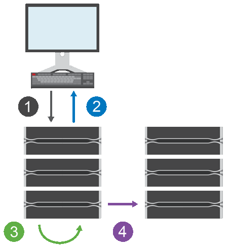

= Fonctionnement de la mise en miroir asynchrone
:allow-uri-read: 
:icons: font
:imagesdir: ../media/

[role="lead"]
La mise en miroir asynchrone copie les volumes de données à la demande ou selon une planification. La mise en miroir permet de réduire ou d'éviter les temps d'indisponibilité dus à la corruption ou à la perte de données.

[NOTE]
====
La mise en miroir n'est pas disponible sur la baie de stockage EF600 ou EF300.

====
La mise en miroir asynchrone capture l'état du volume primaire à un moment donné et copie uniquement les données qui ont changé depuis la dernière capture d'image. Le site primaire peut être mis à jour immédiatement et le site secondaire peut être mis à jour à mesure que la bande passante le permet. Les informations sont mises en cache et envoyées ultérieurement, au fur et à mesure que les ressources réseau deviennent disponibles.

Ce type de mise en miroir est idéal pour répondre à la demande en cas de non-fonctionnement continu et, de manière générale, il est bien plus efficace du réseau pour les processus périodiques, comme la sauvegarde et l'archivage. Les raisons d'utiliser la mise en miroir asynchrone sont les suivantes :

* Consolidation de sauvegardes à distance.
* Protection contre les incidents à l'échelle locale ou étendue
* Développement et test d'applications sur une image instantanée des données en direct.

== Session de mise en miroir asynchrone

La mise en miroir asynchrone capture l'état du volume primaire à un moment donné et copie uniquement les données qui ont changé depuis la dernière capture d'image. La mise en miroir asynchrone permet la mise à jour immédiate du site principal et la mise à jour du site secondaire en fonction de la bande passante. Les informations sont mises en cache et envoyées ultérieurement, au fur et à mesure que les ressources réseau deviennent disponibles.

Une session de mise en miroir asynchrone active comporte quatre étapes principales.

. Une opération d'écriture a d'abord lieu sur la matrice de stockage du volume primaire.
. L'état de l'opération est renvoyé à l'hôte.
. Toutes les modifications apportées au volume primaire sont consignées et suivies.
. Toutes les modifications sont envoyées en arrière-plan à la baie de stockage du volume secondaire.

Ces étapes sont répétées selon les intervalles de synchronisation définis ou les étapes peuvent être répétées manuellement si aucun intervalle n'est défini.

La mise en miroir asynchrone transfère les données vers le site distant uniquement à des intervalles définis. Les E/S locales ne sont donc pas affectées presque autant par la lenteur des connexions réseau. Ce transfert n'étant pas lié aux E/S locales, il n'a aucun impact sur les performances des applications. Par conséquent, la mise en miroir asynchrone peut utiliser des connexions plus lentes, comme iSCSI, et s'exécuter sur de plus longues distances entre les systèmes de stockage locaux et distants.

Les matrices de stockage doivent disposer d'une version minimale du micrologiciel 7.84. (Chacun peut exécuter différentes versions d'OS.)

== Mettez en miroir les groupes de cohérence et les paires en miroir

Vous créez un groupe de cohérence miroir pour établir la relation de mise en miroir entre la matrice de stockage locale et la matrice de stockage distante. La relation de mise en miroir asynchrone se compose d'une paire en miroir : un volume primaire sur une baie de stockage et un volume secondaire sur une autre baie de stockage.

La matrice de stockage contenant le volume primaire est généralement située sur le site primaire et sert les hôtes actifs. La matrice de stockage contenant le volume secondaire se trouve généralement sur un site secondaire et contient une réplique des données. Le volume secondaire contient en général une copie de sauvegarde des données, utilisée pour la reprise après incident.

== Paramètres de synchronisation

Lorsque vous créez une paire en miroir, vous définissez également la priorité de synchronisation et la stratégie de resynchronisation que la paire en miroir utilise pour terminer l'opération de resynchronisation après une interruption de communication.

Lorsque vous créez un groupe de cohérence miroir, vous définissez également la priorité de synchronisation et la règle de resynchronisation pour toutes les paires en miroir du groupe. Les paires mises en miroir utilisent la priorité de synchronisation et la règle de resynchronisation pour terminer l'opération de resynchronisation après une interruption de communication.

Les volumes primaire et secondaire d'une paire en miroir peuvent ne pas être synchronisés lorsque la matrice de stockage du volume primaire n'est pas en mesure d'écrire les données sur le volume secondaire. Cette situation peut être liée aux problèmes suivants :

* Problèmes de réseau entre les matrices de stockage locales et distantes.
* Un volume secondaire en panne.
* La synchronisation est suspendue manuellement sur la paire en miroir.
* Conflit de rôle de groupe miroir.

Vous pouvez synchroniser les données de la matrice de stockage distante manuellement ou automatiquement.

== Capacité réservée et mise en miroir asynchrone

La capacité réservée permet de suivre les différences entre le volume principal et le volume secondaire lorsque la synchronisation n'est pas en cours. Il conserve également le suivi des statistiques de synchronisation pour chaque paire en miroir.

Chaque volume d'une paire en miroir nécessite sa propre capacité réservée.

== Configuration et gestion

Pour activer et configurer la mise en miroir entre deux baies, vous devez utiliser l'interface Unified Manager. Une fois la mise en miroir activée, vous pouvez gérer les paires en miroir et les paramètres de synchronisation dans System Manager.
