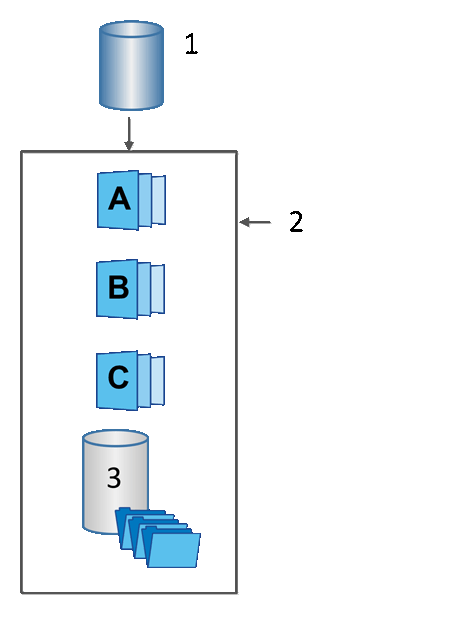

= Volumes de base, capacité réservée et groupes Snapshot
:allow-uri-read: 
:icons: font
:imagesdir: ../media/

[role="lead"]
La fonction snapshots utilise les volumes de base, la capacité réservée et les groupes snapshots.

== Volumes de base

Un _volume de base_ est le volume utilisé comme source pour une image d'instantané. Un volume de base peut être un volume non fin ou un volume non fin, et peut résider dans un pool ou un groupe de volumes.

Pour prendre des instantanés du volume de base, vous pouvez créer une image instantanée à tout moment, ou vous pouvez automatiser le processus en définissant un planning régulier pour les snapshots.

La figure suivante montre les relations entre les objets de snapshot et le volume de base.

^1^ Volume de base ; ^2^ objets Snapshot du groupe (images et capacité réservée) ; ^3^ capacité réservée pour le groupe de snapshots.

== Capacité réservée et groupes snapshots

System Manager organise les images de snapshot en _snapshot Groups_. Lorsque System Manager établit le groupe de snapshots, il crée automatiquement _Reserved Capacity_ associé pour contenir les images de snapshot du groupe et pour garder le suivi des modifications ultérieures apportées aux snapshots supplémentaires.

Si le volume de base réside dans un groupe de volumes, la capacité réservée peut être située dans un pool ou un groupe de volumes. Si le volume de base réside dans un pool, la capacité réservée doit se trouver dans le même pool que le volume de base.

Les groupes de snapshots ne nécessitent aucune action de l'utilisateur, mais vous pouvez ajuster à tout moment la capacité réservée d'un groupe de snapshots. Par ailleurs, vous pouvez être invité à créer de la capacité réservée lorsque les conditions suivantes sont remplies :

* Chaque fois que vous prenez un snapshot d'un volume de base qui ne dispose pas encore d'un groupe Snapshot, System Manager crée automatiquement un groupe de snapshots. Cette action crée également une capacité réservée pour le volume de base utilisé pour stocker les images instantanées suivantes.
* Chaque fois que vous créez un planning de snapshots pour un volume de base, System Manager crée automatiquement un groupe de snapshots.

== Suppression automatique

Lorsque vous utilisez des instantanés, utilisez l'option par défaut pour activer la suppression automatique. La suppression automatique supprime automatiquement l'image snapshot la plus ancienne lorsque le groupe d'instantanés atteint la limite de groupe d'instantanés de 32 images. Si vous désactivez la suppression automatique, les limites des groupes de snapshots sont en fin de compte dépassées et vous devez effectuer des actions manuelles pour configurer les paramètres des groupes de snapshots et gérer la capacité réservée.
