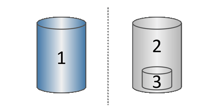

= Fonctionnement du stockage Snapshot
:allow-uri-read: 
:icons: font
:imagesdir: ../media/

[role="lead"]
La fonctionnalité snapshots utilise la technologie de copie en écriture pour stocker des images d'instantanés et utiliser la capacité réservée allouée.

== Mode d'utilisation des images instantanées

Une image Snapshot est une copie logique, en lecture seule, du contenu de volume, capturée à un moment donné. Vous pouvez utiliser des snapshots pour vous protéger contre toute perte de données.

Les images Snapshot sont également utiles pour les environnements de test. Grâce à la création d'une copie virtuelle des données, vous pouvez tester ces données via une copie Snapshot sans modifier le volume réel. De plus, les hôtes ne disposent pas d'un accès en écriture aux images de snapshot, de sorte que vos snapshots constituent toujours une ressource de sauvegarde sécurisée.

== La création de copies Snapshot

Au fur et à mesure de la création des instantanés, la fonction snapshots stocke les données d'image comme suit :

* Toute image Snapshot reflète exactement le volume de base tel qu'il était au moment de la création de la copie. La fonctionnalité Snapshot utilise la technologie de copie sur écriture. Après la création de la copie Snapshot, la première écriture dans un bloc ou dans un ensemble de blocs du volume de base entraîne la copie des données initiales dans la capacité réservée avant d'enregistrer ces nouvelles données dans le volume de base.
* Les snapshots suivants ne incluent que les blocs de données modifiés. Avant d'écraser les données sur le volume de base, la fonction snapshots utilise sa technologie de copie en écriture pour enregistrer les images requises des secteurs concernés dans la capacité réservée de snapshot.
+

^1^ volume de base (capacité du disque physique) ; ^2^ snapshots (capacité du disque logique) ; ^3^ capacité réservée (capacité du disque physique)

* La capacité réservée stocke les blocs de données originaux pour les parties du volume de base qui ont été modifiées après la prise de l'instantané et inclut un index pour le suivi des modifications. En général, la taille de la capacité réservée correspond par défaut à 40 % du volume de base. (Si vous avez besoin de plus de capacité réservée, vous pouvez augmenter la capacité réservée.)
* Les images instantanées sont stockées dans un ordre spécifique, en fonction de leur horodatage. Seule l'image snapshot la plus ancienne d'un volume de base est disponible pour la suppression manuelle.

== Restauration Snapshot

Pour restaurer les données vers un volume de base, vous pouvez utiliser soit un volume Snapshot, soit une image Snapshot :

* *Instantané volume* -- si vous devez récupérer des fichiers supprimés, créez un volume de snapshot à partir d'une image snapshot en bon état, puis affectez-le à l'hôte.
* *Image snapshot* -- si vous devez restaurer un volume de base à un point dans le temps spécifique, utilisez une image snapshot précédente pour restaurer les données vers le volume de base.

